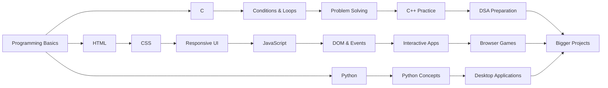
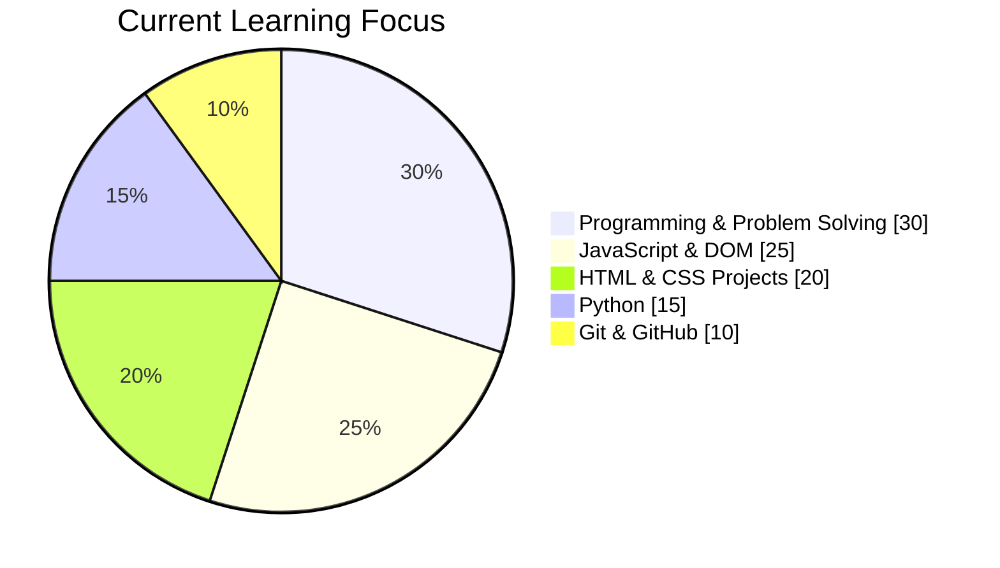

<div align="center">


<a href="https://git.io/typing-svg">
  
</a>

<br />

### 🚀 A growing collection of code, experiments, mini applications, games, and web projects

<p>
  This repository is not a finished product.
  <br />
  <strong>It is the timeline of my journey from learning syntax to building real things.</strong>
</p>

<br />

<a href="#-featured-projects">
  
</a>
<a href="#-repository-map">
  
</a>
<a href="#-getting-started">
  
</a>

<br />
<br />


<br />


</div>

---

# 👋 Welcome to My Learning Path

> **I don't just watch coding tutorials. I write code, make mistakes, debug problems, and build projects.**

This repository documents my hands-on journey through **programming, problem solving, frontend development, JavaScript interactivity, and Python applications**.

It started with simple programs.

Variables. Conditions. Loops.

Then came arrays, functions, patterns, and problem solving.

After that, I started building interfaces with **HTML and CSS**, adding behavior with **JavaScript**, creating browser games, and experimenting with desktop applications using **Python**.

Every folder represents a stage of learning.

Every project represents a concept turned into something visible.

<div align="center">

### 💡 My Learning Philosophy

```text
LEARN  ➜  PRACTICE  ➜  BUILD  ➜  BREAK  ➜  DEBUG  ➜  IMPROVE
                               ↖______________________________|
```

</div>

---

# 🧠 What Is This Repository?

<table>
<tr>
<td width="50%" valign="top">

### 📚 A Learning Archive

Programming exercises created while understanding new concepts.

From simple syntax to problem-solving practice.

</td>
<td width="50%" valign="top">

### 🛠️ A Project Workshop

Web pages, applications, interfaces, and browser games.

Ideas are converted into code here.

</td>
</tr>

<tr>
<td width="50%" valign="top">

### 🧪 An Experiment Lab

Not every project is perfect.

Some projects exist because I wanted to test an idea, animation, layout, or JavaScript behavior.

</td>
<td width="50%" valign="top">

### 📈 A Progress Timeline

Old code and newer code live together.

That makes the repository a visible record of how my coding style and understanding are improving.

</td>
</tr>
</table>

---

# ⚡ Technology Stack

<div align="center">

### Programming Languages


<br />

### Frontend Development


<br />

### Tools & Development Environment


<br />
<br />

|   Technology   | What I Use It For                                                        |
| :------------: | ------------------------------------------------------------------------ |
|      **C**     | Programming fundamentals, conditions, loops, and logical problem solving |
|     **C++**    | Programming practice, patterns, problem solving, and DSA preparation     |
|   **Python**   | Core Python concepts, practice, and desktop applications                 |
|    **HTML5**   | Structure of websites and browser applications                           |
|    **CSS3**    | Responsive layouts, UI design, animations, and visual styling            |
| **JavaScript** | DOM manipulation, validation, events, and interactive applications       |
|     **Git**    | Tracking changes and learning version control                            |
|   **GitHub**   | Storing projects and documenting my development journey                  |

</div>

---

# 🌟 Featured Projects

<div align="center">

## 🏫 CBSE Public School Website

</div>

<table>
<tr>
<td width="30%" align="center">

### 🏫

**School Website**

`HTML` `CSS`

</td>
<td>

A multi-page school website featuring navigation, a hero section, educational programs, campus-life cards, and a dedicated About page.

**Concepts explored**

`Multi-page Design` • `Responsive UI` • `Navigation` • `Content Layout`

### 🔗 [Explore Project →](collage_website/school/index.html)

</td>
</tr>
</table>

---

<div align="center">

## 📝 JavaScript Note App

</div>

<table>
<tr>
<td width="30%" align="center">

### 📝

**Note Application**

`HTML` `CSS` `JavaScript`

</td>
<td>

A responsive browser-based note application with input validation, a **300-character limit**, dynamic note creation, and note deletion.

**Concepts explored**

`DOM` • `Events` • `Validation` • `Dynamic Elements`

### 🔗 [Explore Project →](javascript%20project/note_app.html)

</td>
</tr>
</table>

---

<div align="center">

## 🔍 Live Search Filter

</div>

<table>
<tr>
<td width="30%" align="center">

### 🔍

**Search Application**

`HTML` `CSS` `JavaScript`

</td>
<td>

A live search interface that filters a list of names while the user types.

**Concepts explored**

`Input Events` • `Array Filtering` • `DOM Updates` • `Live Search`

### 🔗 [Explore Project →](javascript%20project/search_filter_app.html)

</td>
</tr>
</table>

---

<div align="center">

## 🔢 Interactive Counter Demo

</div>

<table>
<tr>
<td width="30%" align="center">

### 🔢

**Interactive Counter**

`HTML` `CSS` `JavaScript`

</td>
<td>

A pointer-based counter with press-and-hold counting, reset functionality, and animated visual feedback.

**Concepts explored**

`Mouse Events` • `Timers` • `State` • `CSS Animation`

### 🔗 [Explore Project →](javascript%20project/practics.html)

</td>
</tr>
</table>

---

<div align="center">

## 🎨 Practice Website

</div>

<table>
<tr>
<td width="30%" align="center">

### 🎨

**Gallery Website**

`HTML` `CSS`

</td>
<td>

A gallery-style practice website featuring navigation, multiple content sections, image grids, blogs, and contact layouts.

**Concepts explored**

`Page Sections` • `Grid Layout` • `UI Practice` • `Responsive Design`

### 🔗 [Explore Project →](HTML_CSS/Gelary/desine_my_page.html)

</td>
</tr>
</table>

---

<div align="center">

## 🧩 Project Hub

</div>

<table>
<tr>
<td width="30%" align="center">

### 🧩

**13 Web Projects**

`HTML` `CSS`

</td>
<td>

A browsable project hub containing **13 landing pages, portfolios, blogs, login interfaces, and UI experiments**.

It represents one of the larger collections of frontend practice inside this repository.

**Concepts explored**

`Landing Pages` • `Portfolio UI` • `Forms` • `Reusable Design Practice`

### 🔗 [Open Project Hub →](big%20project/project.html)

</td>
</tr>
</table>

---

<div align="center">

## 🎮 Tic-Tac-Toe

</div>

<table>
<tr>
<td width="30%" align="center">

### ❌ ⭕

**Browser Game**

`HTML` `CSS` `JavaScript`

</td>
<td>

A responsive two-player Tic-Tac-Toe game featuring turn tracking, win detection, draw detection, and game reset functionality.

**Concepts explored**

`Game Logic` • `Conditions` • `DOM` • `State Management`

### 🔗 [Play / View Project →](GAME'S/tic_tac_toe.html)

</td>
</tr>
</table>

---

<div align="center">

## 🧮 Python Desktop Calculator

</div>

<table>
<tr>
<td width="30%" align="center">

### 🧮

**Desktop Application**

`Python` `Tkinter`

</td>
<td>

A desktop calculator featuring keyboard input, decimals, parentheses, mathematical expression handling, and error management.

**Concepts explored**

`Python GUI` • `Events` • `Functions` • `Error Handling`

### 🔗 [Explore Source Code →](python/project/calculator/first_calculator_after_learning%20_python.py)

</td>
</tr>
</table>

---

<div align="center">

## 💳 Debit Card UI

</div>

<table>
<tr>
<td width="30%" align="center">

### 💳

**UI Experiment**

`HTML` `CSS`

</td>
<td>

Front and back debit card layouts created using gradients, glassmorphism-inspired styling, and responsive CSS.

**Concepts explored**

`Gradients` • `Glassmorphism` • `Responsive CSS` • `UI Details`

### 🔗 [Explore Project →](HTML_CSS/debit%20card/second.html)

</td>
</tr>
</table>

---

<div align="center">

## 🔐 Contact & Access Portal

</div>

<table>
<tr>
<td width="30%" align="center">

### 🔐

**Responsive Portal**

`HTML` `CSS` `JavaScript`

</td>
<td>

A dual-purpose contact and login interface featuring a sliding desktop transition and mobile-friendly tab navigation.

**Concepts explored**

`Responsive Forms` • `Transitions` • `DOM Events` • `Mobile UI`

### 🔗 [Explore Project →](HTML_CSS/login_send_message_page/responsive_login_page.html)

</td>
</tr>
</table>

---

# 🧪 More Projects & Practice

<details>
<summary><b>🌐 HTML & CSS Projects</b></summary>

<br />

Inside the HTML and CSS sections, I have experimented with:

* Responsive login interfaces
* Landing pages
* Travel page designs
* Amazon-style shopping interfaces
* Debit card UI designs
* Gallery layouts
* Contact forms
* Calculator interfaces
* To-do list interfaces
* Navigation systems
* Blog layouts
* Portfolio experiments

📂 [`HTML_CSS/`](HTML_CSS/)

</details>

<details>
<summary><b>⚡ JavaScript Mini Applications</b></summary>

<br />

My JavaScript practice focuses on turning static interfaces into interactive applications.

Projects include:

* Note application
* Live search filter
* Interactive counter
* DOM experiments
* Event handling practice
* Validation experiments

📂 [`javascript project/`](javascript%20project/)

</details>

<details>
<summary><b>🐍 Python Practice</b></summary>

<br />

Python practice includes:

* Core Python syntax
* Tuple exercises
* Slicing
* Unpacking
* Nested data structures
* Basic analysis
* Functions
* Concept practice
* Desktop application experiments
* password genration system

📂 [`python/`](python/)

</details>

<details>
<summary><b>🔵 C Programming Practice</b></summary>

<br />

C exercises focus on strengthening programming fundamentals.

Topics include:

* Input and output
* Mathematical calculations
* Conditions
* Loops
* Logical exercises
* Problem solving

📂 [`programing language/c programing/`](programing%20language/c%20programing/)

</details>

<details>
<summary><b>⚙️ C++ Practice</b></summary>

<br />

C++ exercises currently include:

* Decision making
* Conditions
* Loops
* Pattern problems
* Programming logic
* DSA preparation practice

📂 [`programing language/c++/`](programing%20language/c++/)

</details>

<details>
<summary><b>🎮 Browser Games</b></summary>

<br />

This section contains games created while understanding JavaScript logic and browser interaction.

📂 [`GAME'S/`](GAME'S/)

</details>

---

# 🗺️ My Learning Journey



<div align="center">

### The destination is not one programming language.

### The goal is to become better at **thinking, solving, and building**.

</div>

---

# 🗂️ Repository Map

```text
first/
│
├── 📄 README.md
│
├── 🧩 big project/
│   └── project.html
│       └── Hub containing 13 web design projects
│
├── 🔵 c_practics/
│   └── C loop practice
│
├── 🏫 collage_website/
│   └── school/
│       └── Multi-page CBSE school website
│
├── 🎮 GAME'S/
│   └── Browser games
│
├── 🌐 HTML_CSS/
│   │
│   ├── 💳 debit card/
│   │
│   ├── 🎨 Gelary/
│   │   └── Practice website and gallery layout
│   │
│   ├── 🚀 landing_page/
│   │
│   ├── 🔐 login page/
│   │
│   ├── 📩 login_send_message_page/
│   │   └── Responsive contact and access portal
│   │
│   ├── 🧪 small_praoject/
│   │   ├── 🛒 amazon clon/
│   │   ├── 🧮 calculator/
│   │   └── ✅ todo list/
│   │
│   └── ✈️ travel_page/
│
├── ⚡ javascript project/
│   ├── Note application
│   ├── Search filter
│   └── Interactive counter
│    
├── 💻 programing language/
│   │
│   ├── 🔵 c programing/
│   │   └── C exercises
│   │
│   └── ⚙️ c++/
│       ├── condition/
│       └── loops/
│
└── 🐍 python/
    │
    ├── full python concept/
    │   └── Python concept practice
    │
    └── project/
        └── calculator/
            └── Tkinter desktop calculator
            └── password_generator.py
```

> [!NOTE]
> Some folder and file names preserve the names I used when I first created them.
> I intentionally keep parts of this structure because the repository is also a record of my learning journey and improvement over time.

---

# ⚡ Getting Started

## 1️⃣ Clone This Repository

```bash
git clone https://github.com/munnnakumargpj4321-prog/first.git
```

Move into the project directory:

```bash
cd first
```

---

## 🌐 Running Web Projects

Most browser projects do not require package installation.

Open the project's main `.html` file in your browser.

A good starting point is:

```text
big project/project.html
```

This opens a hub containing multiple web design projects.

### Using VS Code

You can also use the **Live Server** extension.

1. Open the repository in VS Code.
2. Open an `.html` file.
3. Right-click inside the editor.
4. Select **Open with Live Server**.

---

## 🐍 Running Python Projects

Make sure Python 3 is installed.

Run the calculator:

```bash
python "python/project/calculator/first_calculator_after_learning _python.py"
```

Run the tuple practice file:

```bash
python "python/full python concept/tupple/basic.py"
```

On Windows, you may need to use:

```bash
py "python/project/calculator/first_calculator_after_learning _python.py"
```

> [!TIP]
> The tuple exercise asks for an item name near the end. You can enter a value such as `pen` when prompted.

---

## 🔵 Running C Programs

Make sure GCC is installed.

Compile:

```bash
gcc "programing language/c programing/120_loops_solved_question.c" -o loop_practice
```

Run on Linux or macOS:

```bash
./loop_practice
```

Run in Windows PowerShell:

```powershell
.\loop_practice.exe
```

---

## ⚙️ Running C++ Programs

Make sure G++ is installed.

Compile:

```bash
g++ "programing language/c++/loops/pattern.cpp" -o pattern
```

Run on Linux or macOS:

```bash
./pattern
```

Run in Windows PowerShell:

```powershell
.\pattern.exe
```

> [!IMPORTANT]
> Some larger C and C++ files contain multiple exercises or works in progress. They are best explored one problem at a time.

---

# 🎯 What I Am Currently Learning

<div align="center">

| 💡 Area              | 🚧 Current Focus                                          |
| :------------------- | :-------------------------------------------------------- |
| **Problem Solving**  | Improving logical thinking through programming exercises  |
| **C & C++**          | Strengthening fundamentals and preparing for DSA          |
| **Python**           | Moving from syntax toward structured projects             |
| **HTML & CSS**       | Building cleaner and more responsive interfaces           |
| **JavaScript**       | DOM manipulation, events, and real-life mini applications |
| **Git & GitHub**     | Better project organization and version control           |
| **Project Building** | Converting concepts into usable applications              |

</div>

---

# 📈 Learning Progress



> The chart represents my learning focus, not a measurement of expertise.

---

# 🛣️ Roadmap

### ✅ Completed / Practiced

* [x] Learn programming fundamentals
* [x] Practice C programming
* [x] Start C++ problem solving
* [x] Build HTML pages
* [x] Create responsive CSS layouts
* [x] Build JavaScript mini applications
* [x] Practice DOM manipulation
* [x] Build a browser game
* [x] Create a Python desktop calculator
* [x] Start using Git and GitHub consistently

### 🚧 Currently Working On

* [ ] Strengthen JavaScript DOM concepts
* [ ] Build more real-life JavaScript projects
* [ ] Improve C++ problem-solving skills
* [ ] Practice DSA systematically
* [ ] Create cleaner repository structures
* [ ] Improve project documentation

### 🔮 Future Goals

* [ ] Add live demos for featured web projects
* [ ] Build larger JavaScript applications
* [ ] Learn APIs and JSON deeply
* [ ] Build projects using real APIs
* [ ] Learn backend development
* [ ] Create full-stack applications
* [ ] Build portfolio-level projects
* [ ] Contribute to open-source projects

---

# 📊 GitHub Journey

<div align="center">


<br />


<br />


</div>

> GitHub statistics are dynamically generated and may occasionally take a moment to load.

---

# 💭 Why I Keep My Practice Code

When learning programming, it is easy to think:

> “This code is too simple to upload.”

I see it differently.

A loop exercise shows where I started.

A small webpage shows when I learned layouts.

A JavaScript application shows when a static page became interactive.

A game shows how conditions and state can work together.

A desktop application shows the transition from terminal code to graphical software.

**Simple projects are not useless.**

They become evidence of progress when you continue building.

That is why this repository contains both **practice and projects**.

---

# 🤝 Contributions & Suggestions

This repository mainly documents my personal learning journey, but suggestions are always welcome.

Found a problem?

Have an idea to improve one of the projects?

Want to suggest a better approach?

### You can:

1. Fork the repository.
2. Create a new branch.

```bash
git checkout -b improvement/your-idea
```

3. Make your changes.
4. Commit your work.

```bash
git commit -m "Improve project feature"
```

5. Push the branch.

```bash
git push origin improvement/your-idea
```

6. Open a Pull Request.

<div align="center">

**Constructive feedback is part of learning. 🤝**

</div>

---

# ⭐ Support This Learning Journey

<div align="center">

If you explore this repository and find something interesting or useful:

<br />
<br />

### ⭐ Give the repository a star

### 🍴 Fork a project and experiment with it

### 💡 Share an improvement idea

### 👨‍💻 Keep building your own projects

<br />

<a href="https://github.com/munnnakumargpj4321-prog/first">
  
</a>

<a href="https://github.com/munnnakumargpj4321-prog/first/stargazers">
  
</a>

</div>

---

# 👨‍💻 Author

<div align="center">


## Munna Kumar

### B.Tech CSE Student • Programmer • Project Builder • Continuous Learner

I am learning software development by combining **concepts, consistent practice, and hands-on project building**.

My goal is simple:

> **Understand deeply. Practice consistently. Build real things. Improve every day.**

<br />

<a href="https://github.com/munnnakumargpj4321-prog">
  
</a>

</div>

---

<div align="center">

### 💻 Code is written one line at a time.

### 🚀 Skills are built one project at a time.

### 🔥 Progress is created one day at a time.

<br />

<a href="#-welcome-to-my-learning-path">
  
</a>

<br />
<br />


### ⭐ From syntax to projects. From projects to experience.

**Built with curiosity, consistency, and a lot of debugging by Munna Kumar.**

</div>


<!-- <div align="center">

# Learning Path

### From programming fundamentals to interactive web experiences

My hands-on collection of coding exercises, small applications, and web projects built while learning **C, C++, Python, HTML, CSS, and JavaScript**.

[Explore Projects](#featured-projects) | [View Structure](#repository-structure) | [Get Started](#getting-started)


</div>

## About This Repository

This repository documents my progress as I learn software development by building. It includes programming exercises for strengthening core concepts, responsive user interfaces, browser-based applications, JavaScript mini apps, and a desktop calculator made with Tkinter.

## Featured Projects

| Project | What it demonstrates | Built with |
| --- | --- | --- |
| [CBSE Public School Website](collage_website/school/index.html) | A multi-page school website with a hero section, navigation, programs, campus-life cards, and a dedicated About page | HTML, CSS |
| [JavaScript Note App](javascript%20project/note_app.html) | A responsive note-taking app with input validation, a 300-character limit, and note deletion | HTML, CSS, JavaScript |
| [Search Filter App](javascript%20project/search_filter_app.html) | A live search interface that filters a list of names as you type | HTML, CSS, JavaScript |
| [Interactive Counter Demo](javascript%20project/practics.html) | A pointer-based counter with press-and-hold counting, reset support, and animated feedback | HTML, CSS, JavaScript |
| [Practice Website](HTML_CSS/Gelary/desine_my_page.html) | A gallery-style practice website with navigation, sections, image grids, and blog/contact layouts | HTML, CSS |
| [Project Hub](big%20project/project.html) | A browsable collection of 13 landing pages, portfolios, blogs, login forms, and UI experiments | HTML, CSS |
| [Tic-Tac-Toe](GAME'S/tic_tac_toe.html) | A responsive two-player game with turn tracking, win and draw detection, and game reset | HTML, CSS, JavaScript |
| [Python Calculator](python/project/calculator/first_calculator_after_learning%20_python.py) | A Tkinter desktop calculator with keyboard input, parentheses, decimals, and error handling | Python, Tkinter |
| [Debit Card UI](HTML_CSS/debit%20card/second.html) | Front and back card layouts using gradients, glassmorphism, and responsive styling | HTML, CSS |
| [Contact & Access Portal](HTML_CSS/login_send_message_page/responsive_login_page.html) | A dual-purpose portal featuring a contact form and a login form with a sliding transition on desktop and mobile-friendly tabs | HTML, CSS, JavaScript |

## More Projects and Practice

- Responsive login, landing, travel, and Amazon-style shopping pages
- A responsive Contact & Access Portal in `HTML_CSS/login_send_message_page/` featuring animated sliding forms and mobile tab controls
- A gallery-style practice website in `HTML_CSS/Gelary/`
- Browser-based to-do list and calculator interfaces
- JavaScript practice apps in `javascript project/`, including a note app, a search filter, and an interactive counter demo
- Python tuple exercises covering slicing, unpacking, nesting, and basic analysis
- C exercises covering input, calculations, conditions, loops, and problem solving
- C++ exercises covering decision making and loop-based pattern generation

## Repository Structure

```text
first/
|-- README.md
|-- big project/                  # Hub containing 13 web design projects
|-- c_practics/                   # C loop practice
|-- collage_website/
|   `-- school/                   # Multi-page CBSE school website
|-- GAME'S/                       # Browser games
|-- HTML_CSS/                     # HTML and CSS practice projects
|   |-- debit card/
|   |-- Gelary/                   # Practice website and gallery layout
|   |-- landing_page/
|   |-- login page/
|   |-- login_send_message_page/  # Responsive contact & access portal with sliding transition
|   |-- small_praoject/
|   |   |-- amazon clon/
|   |   |-- calculator/
|   |   `-- todo list/
|   `-- travel_page/
|-- javascript project/           # JavaScript mini applications (note app, search filter, counter demo)
|-- programing language/
|   |-- c programing/             # C exercises
|   `-- c++/
|       |-- condition/            # Decision-making exercises
|       `-- loops/                # Pattern exercises
`-- python/
    |-- full python concept/      # Python concept practice
    `-- project/calculator/       # Tkinter calculator
```

> Some directory names preserve the names used when I first created them, making the repository itself a record of my learning journey.

## Getting Started

Clone the repository:

```bash
git clone https://github.com/munnnakumargpj4321-prog/first.git
cd first
```

### Web projects

Open any project's main `.html` file in a browser. A good place to begin is [`big project/project.html`](big%20project/project.html), which links to 13 web designs.

### Python projects

Install Python 3 with Tkinter support before running the desktop calculator.

```bash
python "python/project/calculator/first_calculator_after_learning _python.py"
python "python/full python concept/tupple/basic.py"
```

The tuple exercise asks for an item name near the end; enter a value such as `pen` when prompted.
On Windows, use `py` instead of `python` if that is the launcher available on your system.

### C and C++ practice

```bash
gcc "programing language/c programing/120_loops_solved_question.c" -o loop_practice
g++ "programing language/c++/loops/pattern.cpp" -o pattern
```

Run the compiled file with `./loop_practice` or `./pattern`. On Windows PowerShell, add the `.exe` extension.

The larger C and C++ practice files collect works in progress and multiple exercises in one place, so they are best explored exercise by exercise.

## What I Am Learning

- Writing clearer logic and solving problems step by step
- Building responsive layouts with reusable CSS
- Adding interactivity and validation with JavaScript
- Creating desktop interfaces with Python and Tkinter
- Organizing projects and tracking progress with Git and GitHub

## Roadmap

- [x] Practice programming fundamentals in C and C++
- [x] Build responsive HTML and CSS pages
- [x] Add JavaScript-powered mini applications
- [x] Create a Python desktop application
- [ ] Add live demos for the featured web projects
- [ ] Build larger full-stack projects

## Author

Created by **Munna Kumar** as a record of consistent learning and hands-on practice.

[](https://github.com/munnnakumargpj4321-prog)

If you find something useful here, consider giving the repository a star. -->
